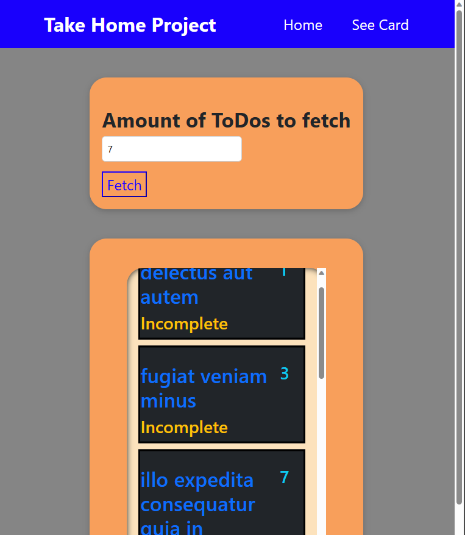
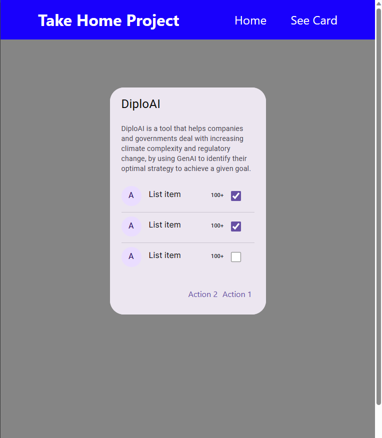

# Take Home Project - DiploAI

This is a pure Next JS application, users can input a number from
1 to 100, and they will get a list of ToDos from the [JSONPlaceHolderAPI](https://jsonplaceholder.typicode.com/todos)

## Tasks

- _Frontend task:_ Implement Figma card design
- _Backend task:_ Implement Server-Side Rendering within the application, and sort ToDos from API

### Solution Details

Server-Side Rendering is implemented inside the "/" route, everytime the server
gets a request from this route, it will prerender 5 ToDos before sending the response to the client.

The list is sorted using the following rules:

- The incomplete ToDos will be displayed at the top, followed by the completed ToDos
- ToDos are sorted lexicographically by their titles

### Dependencies

- Next JS
- TypeScript
- Bootstrap

## Views

- Home View "/":
  

- Card View "/card":
  
